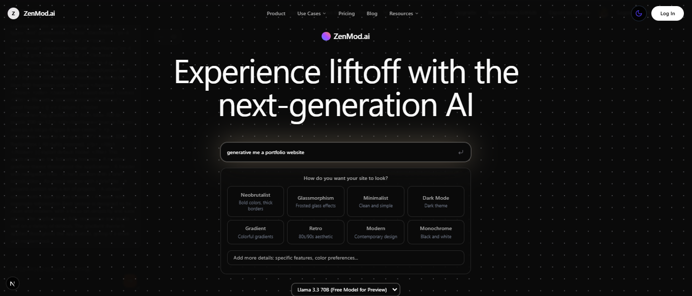
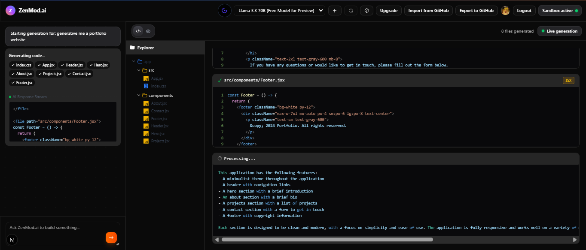
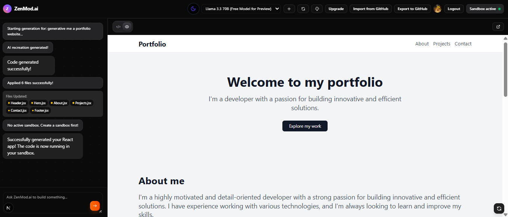
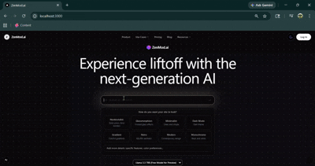
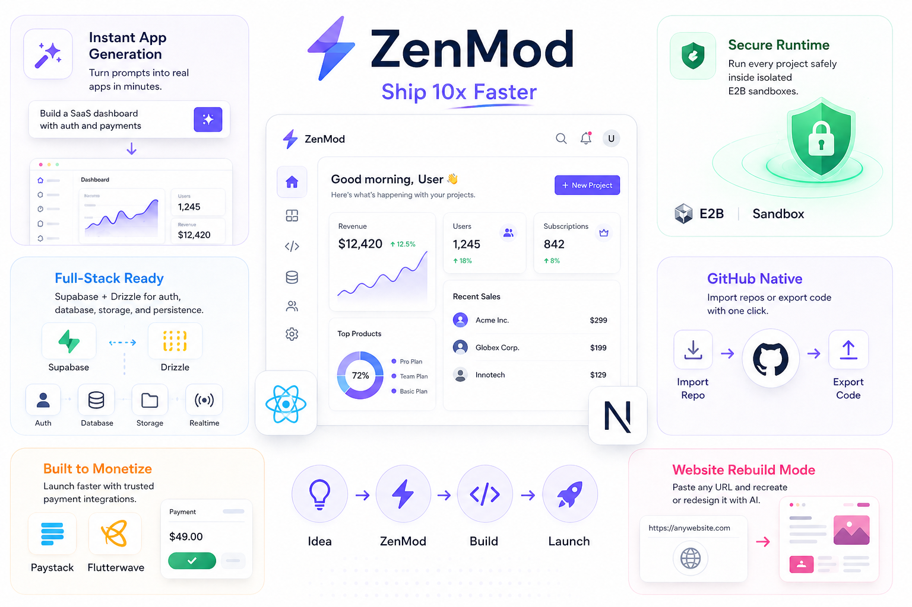
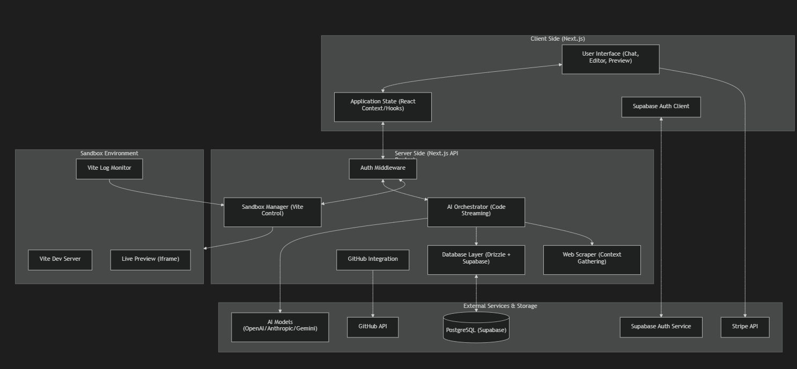

<p align="center">
  
</p>

<p align="center">
  
  
  
  
</p>

## ✨ Demo

`ZenMod.ai` AI-powered coding platform that transforms ideas into production-ready web apps through natural language prompts:

<!-- Full Workspace -->
<p align="center">
  
</p>

<!-- Prompt Builder & Live Preview -->
<p align="center">
  
  
</p>

**ZenMod.ai** is a high-performance, AI-driven platform designed to accelerate web development. By combining the power of Large Language Models (LLMs) with secure, isolated execution environments, ZenMod allows developers and entrepreneurs to build, test, and deploy React applications through a simple conversational interface.

## ✨ Video
<p align="center">
  
</p>

---

<h2 align="center">⚡ Why We Built ZenMod</h2>

<p align="center">
  
  
</p>
<br/>

Modern product building suffers from two major problems: **slow execution** and **high technical friction**.

Founders have ideas but no engineering team. Developers waste hours setting up boilerplate, debugging environments, and repeating the same workflows. Shipping an MVP often takes weeks when it should take hours.


<p align="center">
  
</p>

<p align="center">
  <b>ZenMod.ai turns ideas into deployable products — instantly.</b>
</p>

---


# System Overview

ZenMod enables users to generate React applications through a chat interface, preview them in a real-time sandbox, and export the code to GitHub.

### Core Technologies
- **Framework**: [Next.js](https://nextjs.org/) (App Router)
- **Database**: [PostgreSQL](https://www.postgresql.org/) (via [Supabase](https://supabase.com/))
- **ORM**: [Drizzle ORM](https://orm.drizzle.team/)
- **Authentication**: [Supabase Auth](https://supabase.com/auth)
- **Styling**: [Tailwind CSS](https://tailwindcss.com/)
- **AI Models**: GPT-4, Claude 3.5 Sonnet, etc. (orchestrated via API routes)
- **Payments**: [Stripe](https://stripe.com/)

---

## Architecture Diagram

<p align="center">
  
</p>

---

## Key Data Flows

### 1. AI Code Generation & Streaming
1.  **User Input**: User sends a prompt via the Chat UI.
2.  **Orchestration**: The `generate-ai-code-stream` API route receives the request, gathers context (e.g., existing files, scraped docs), and calls the LLM.
3.  **Streaming**: The LLM streams code blocks back to the client.
4.  **Application**: The client parses the stream and updates the `apply-ai-code` logic to inject the new code into the sandbox.

### 2. Sandbox Lifecycle
1.  **Initialization**: `create-ai-sandbox` sets up a dedicated Vite environment.
2.  **Updates**: As code is generated, the `update_sandbox.mjs` script (or similar logic) writes files to the sandbox volume.
3.  **Monitoring**: `monitor-vite-logs` and `check-vite-errors` provide real-time feedback to the UI if the generated code crashes.

### 3. Database & State Management
1.  **Persistence**: Conversations and user settings are persisted in PostgreSQL using Drizzle.
2.  **Sync**: Supabase subscriptions may be used for real-time updates across multiple tabs or sessions.

### 4. Deployment & Export
1.  **GitHub Export**: Users can push their generated sandbox code to a GitHub repository via the `github` API integration.
2.  **ZIP Download**: Code can be bundled into a ZIP file for local development.

---

## Directory Structure

- `/app`: Next.js App Router (Routes, API, Layouts).
- `/components`: Reusable UI components.
- `/lib`: Core logic (DB, Supabase clients, AI utilities, scrapers).
- `/supabase`: Database migrations and local Supabase config.
- `/public`: Static assets.
- `/types`: TypeScript definitions.


## 🛠️ Tech Stack

-   **Frontend**: Next.js 15 (App Router), React 19, Tailwind CSS, Framer Motion, Radix UI.
-   **AI Infrastructure**: Vercel AI SDK with support for Anthropic (Claude), OpenAI (GPT-4o), Google (Gemini), and Groq (Llama 3).
-   **Backend & DB**: Supabase (Auth/Storage/DB), Drizzle ORM (PostgreSQL).
-   **Runtime**: [E2B](https://e2b.dev/) for sandboxed code execution.
-   **Payments**: Flutterwave & Paystack.

---

## 🏁 Getting Started

### Prerequisites

-   Node.js 20+
-   `pnpm` or `npm`
-   A [Supabase](https://supabase.com/) account
-   An [E2B](https://e2b.dev/) API key

### 1. Clone & Install

```bash
git clone https://github.com/call-meRavi-SHORT-CODE/ZenMod.git
cd ZenMod/ZenMod
pnpm install
```

### 2. Environment Configuration

Create a `.env.local` file in the root directory. Use `.env.example` as a template:

```env
# Core AI & Sandbox
E2B_API_KEY=your_e2b_api_key
FIRECRAWL_API_KEY=your_firecrawl_api_key

# AI Providers (At least one required)
ANTHROPIC_API_KEY=your_anthropic_api_key
OPENAI_API_KEY=your_openai_api_key
GEMINI_API_KEY=your_gemini_api_key
GROQ_API_KEY=your_groq_api_key

# Supabase
NEXT_PUBLIC_SUPABASE_URL=your_project_url
NEXT_PUBLIC_SUPABASE_ANON_KEY=your_anon_key
SUPABASE_SERVICE_ROLE_KEY=your_service_role_key
DATABASE_URL=your_postgres_connection_string

# Payments
PAYSTACK_SECRET_KEY=your_key
FLUTTERWAVE_SECRET_KEY=your_key
```

### 3. Database Setup

Initialize your schema using Drizzle:

```bash
pnpm run db:generate
pnpm run db:migrate
```

### 4. Start Developing

```bash
pnpm run dev
```

The application will be available at `http://localhost:3000`.

---

## 📖 Usage Examples

### Building a New Component
Simply prompt the AI:
> "Create a dashboard with a sidebar, a line chart for sales, and a dark mode toggle using Lucide icons."

### Exporting to GitHub
1. Connect your GitHub account in settings.
2. Click the **Export to GitHub** button once your app is ready.
3. ZenMod will create a new repository and push the generated code.

---

## 🤝 Contributing

We welcome contributions! Please see our [Contributing Guidelines](CONTRIBUTING.md) for more details.

1. Fork the repository.
2. Create a feature branch.
3. Submit a Pull Request.

---

## 📜 License

Distributed under the MIT License. See `LICENSE` for more information.

---
<p align="center">
  Contributors
</p>

<table align="center">
  <tr>
    <td align="center">
      <a href="https://github.com/ravikrishnaj25">
        <br />
        <sub><b>@ravikrishnaj25</b></sub>
      </a><br />
      <sub>AI/ML Engineer</sub>
    </td>
</tr>

</table>

<p align="center">Built with ❤️ by the ZenMod</p>
