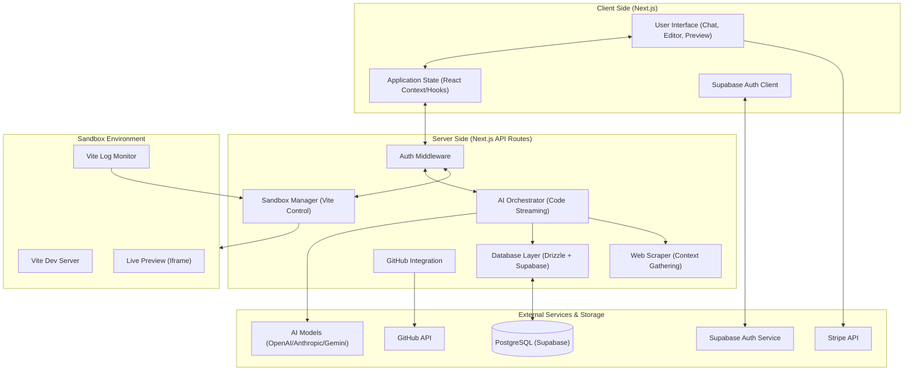

# ZenMod Architecture Flow

This document outlines the high-level architecture and data flow of the ZenMod application. ZenMod is an AI-powered code generation and sandbox platform built with Next.js, Supabase, and Drizzle ORM.

## System Overview

ZenMod enables users to generate React applications through a chat interface, preview them in a real-time sandbox, and export the code to GitHub.

### Core Technologies
- **Framework**: [Next.js](https://nextjs.org/) (App Router)
- **Database**: [PostgreSQL](https://www.postgresql.org/) (via [Supabase](https://supabase.com/))
- **ORM**: [Drizzle ORM](https://orm.drizzle.team/)
- **Authentication**: [Supabase Auth](https://supabase.com/auth)
- **Styling**: [Tailwind CSS](https://tailwindcss.com/)
- **AI Models**: GPT-4, Claude 3.5 Sonnet, etc. (orchestrated via API routes)
- **Payments**: [Stripe](https://stripe.com/)

---

## Architecture Diagram

---

## Key Data Flows

### 1. AI Code Generation & Streaming
1.  **User Input**: User sends a prompt via the Chat UI.
2.  **Orchestration**: The `generate-ai-code-stream` API route receives the request, gathers context (e.g., existing files, scraped docs), and calls the LLM.
3.  **Streaming**: The LLM streams code blocks back to the client.
4.  **Application**: The client parses the stream and updates the `apply-ai-code` logic to inject the new code into the sandbox.

### 2. Sandbox Lifecycle
1.  **Initialization**: `create-ai-sandbox` sets up a dedicated Vite environment.
2.  **Updates**: As code is generated, the `update_sandbox.mjs` script (or similar logic) writes files to the sandbox volume.
3.  **Monitoring**: `monitor-vite-logs` and `check-vite-errors` provide real-time feedback to the UI if the generated code crashes.

### 3. Database & State Management
1.  **Persistence**: Conversations and user settings are persisted in PostgreSQL using Drizzle.
2.  **Sync**: Supabase subscriptions may be used for real-time updates across multiple tabs or sessions.

### 4. Deployment & Export
1.  **GitHub Export**: Users can push their generated sandbox code to a GitHub repository via the `github` API integration.
2.  **ZIP Download**: Code can be bundled into a ZIP file for local development.

---

## Directory Structure

- `/app`: Next.js App Router (Routes, API, Layouts).
- `/components`: Reusable UI components.
- `/lib`: Core logic (DB, Supabase clients, AI utilities, scrapers).
- `/supabase`: Database migrations and local Supabase config.
- `/public`: Static assets.
- `/types`: TypeScript definitions.
